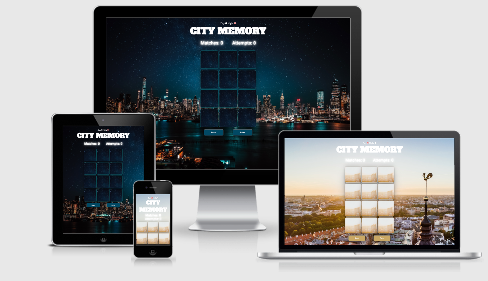
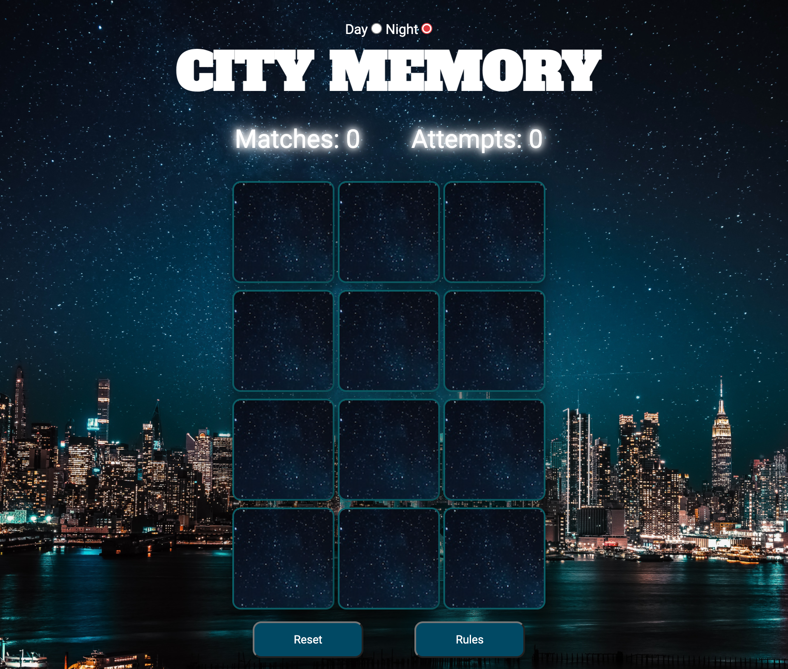
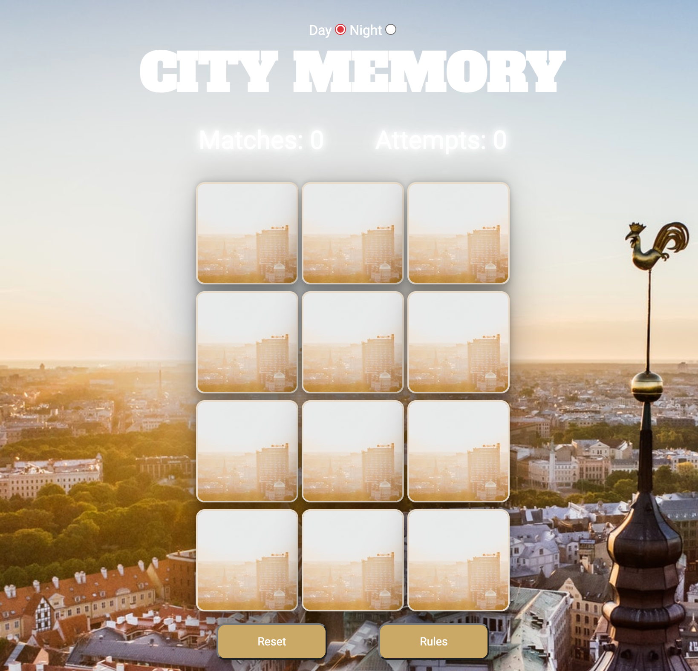
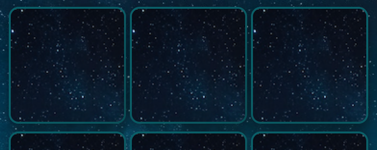
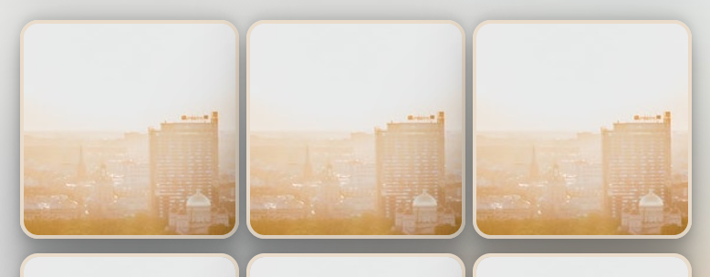
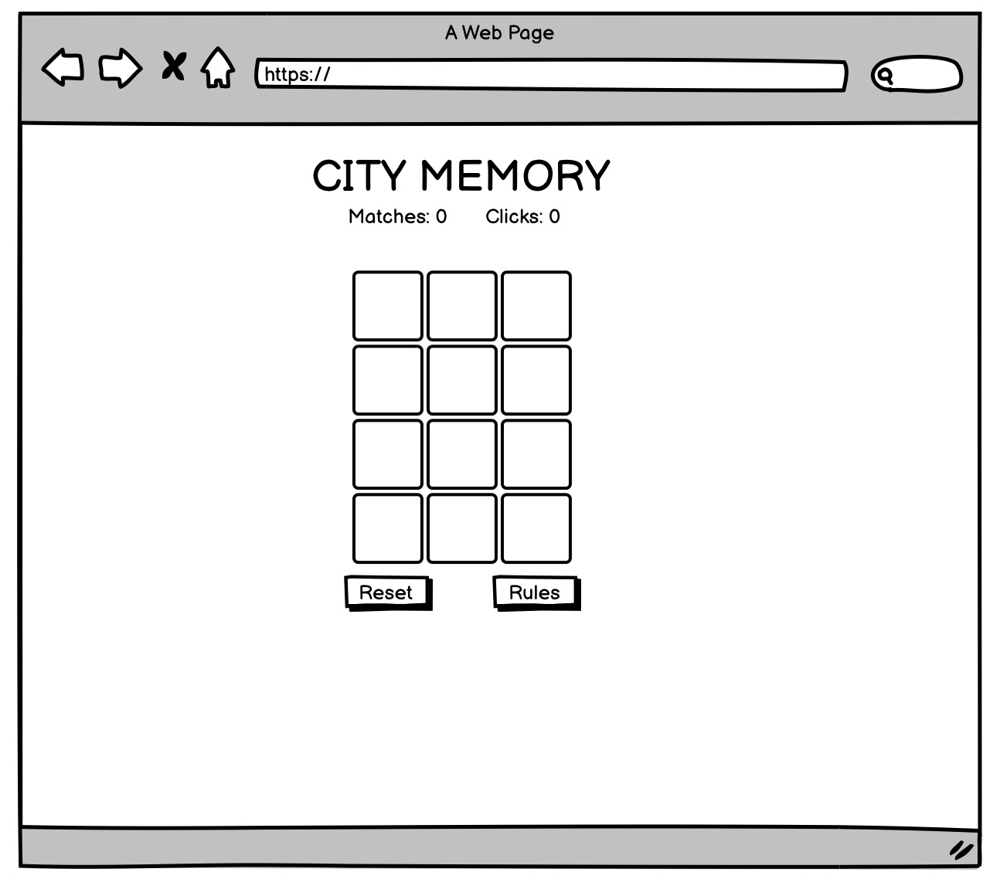
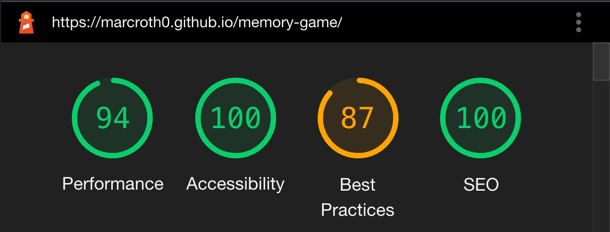
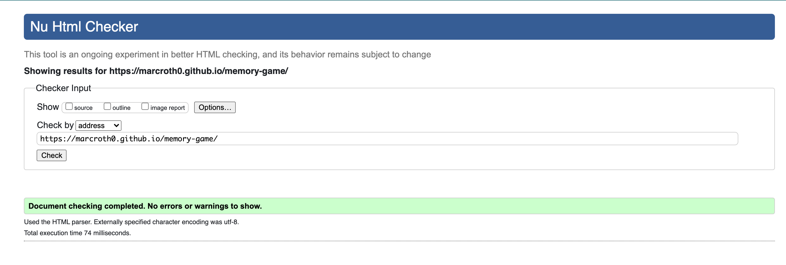
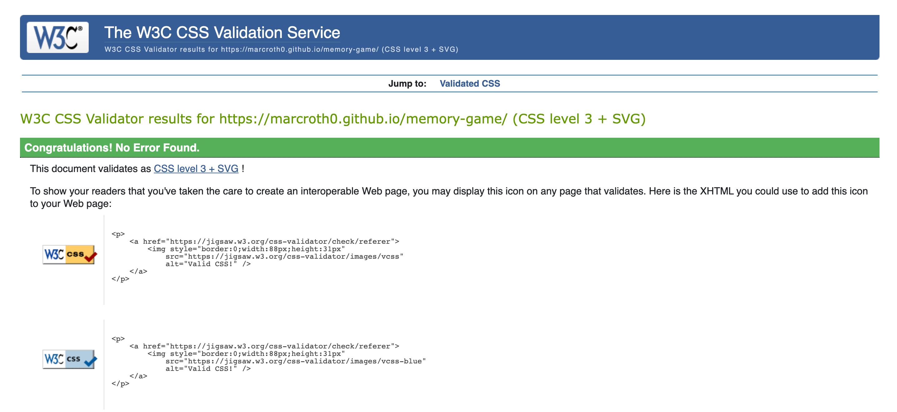
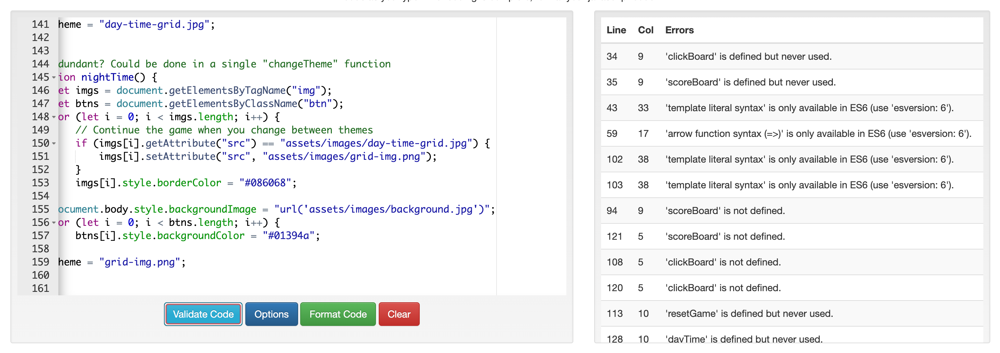

# City Memory Game

Live link: https://marcroth0.github.io/memory-game/

### Table of Contents

1. [Goals](#goals)
    1. [Organisational Goals](#organisation-goals)
    2. [Organisational Stories](#organisation-stories)
    3. [User Stories](#user-stories)
    4. [Target Audience](#target-audience)
2. [Design](#design)
    1. [Box Shadow](#box-shadow)
    2. [Color palette day](#color-palette-day)
    3. [Color palette night](#color-palette-night)
3. [Planning](#planning)
    1. [Fonts](#fonts)
4. [Testing](#testing)
    1. [Lighthouse](#lighthouse)
    2. [Validator](#validator-testing)
5. [Credits](#credits)

## Goals

### Organisation Goals

-   Create an interactive game that is clear and simple
-   Create a layout that is user friendly
-   Please the users with an alteernative in color scheme
-   Attract the users by using famous european sites

### User Stories

1. As a user I want to easily know the rules of the game
2. As a user I want to easily understand how to start the game
3. As a user I need to know what my score is
4. As a user I need to know when the game has been won
5. As a user I want the possibility to be able to reset the game

## Strategy

Memory is a classic game consisting of flipping two cards until you get a match. The game goes along until every card has been matched. This time with a theme of famous european landmarks.

## Design

The design consists of two themes. One day, one night. This to make it easier for users to play depending on the time of day, to releave stress to the eyes.
I chose the colors based on the palette of the themes background.

Considering it being a one-page site it needed to be visually pleasing the moment you enter it.

Night:

Day:

### Box Shadow

It being a "instant play" game I needed to make the grid pop. Adding the shadow behind the tiles gives them a "floating" visual.

Night:

Day:

### Color palette day

### Color palette night

### Planning

I wireframed it using Balsamiq. Considering it was a one-page game it didn't require a lot of planning besides the outline viewed below.

The only thing that strayed from the initial wireframe was the addition of the two themes.

### Fonts

font-family: "Roboto", sans-serif (The rest)
font-family: "Alfa Slab One" (H1/H2)

## Testing

I tested the responsiveness of the site on the below units, using chrome dev as well as some in real life testing:

**Mobile**

-   Moto G4 (360x640)
-   Galaxy S5 (360x640)
-   Pixel 2 (411x731)
-   Pixel 2 XL (411x823)
-   iPhone 5/SE (320x568)
-   iPhone 6/7/8 (375x667)
-   iPhone 6/7/8 Plus (414x736)
-   iPhone X (375x812)
-   iPad (768x1024)
-   iPad Pro (1024x1366)

**Browsers:**

-   Chrome
-   Mozilla Firefox
-   Safari
-   Edge

### Functional testing

See further on click [here](assets/testing.md)

### Lighthouse

### Validator Testing

W3 HTML Validator:

W3 CSS Validator:

JS validator:

The issues portrayed I deemed not needing a fix, considering the "defined but never used" is functions being called in the html-document.

## Unfixed Bugs

No known bugs.

## Features Left to Implement

-   Implement more difficult settings, one being more boxes, and a hard-mode requiring a correct answer to a question relevant to the actual building (if correct guess, shave off a point on 'clicks')
-   An high-score feature.

## Deployment

-   The site was deployed to GitHub pages. The steps to deploy are as follows:
    -   In the GitHub repository, navigate to the Settings tab
    -   From the source section drop-down menu, select the Master Branch
    -   Once the master branch has been selected, the page will be automatically refreshed with a detailed ribbon display to indicate the successful deployment.

The live link can be found here - https://marcroth0.github.io/memory-game/

## Credits

-   Some of the basic structure was inspired by [Fakorede Damilola](https://dev.to/fakorededamilola/create-a-memory-game-with-js-1l9j)

## Media

-   Images used was taken from [Pexels](https://www.pexels.com/photo/photo-of-skyline-at-night-3075993/)
