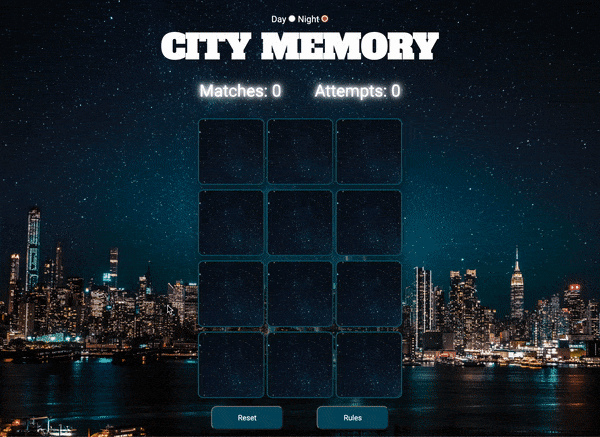
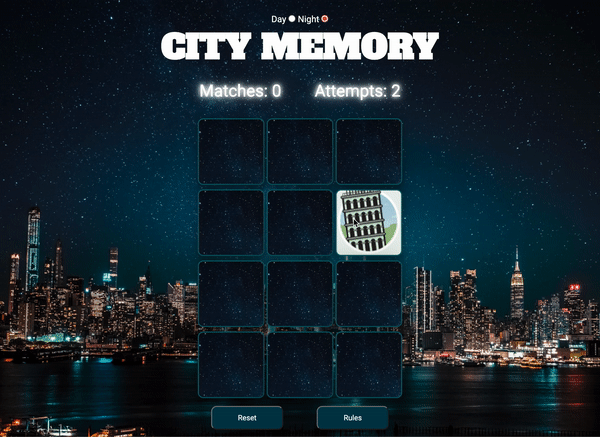
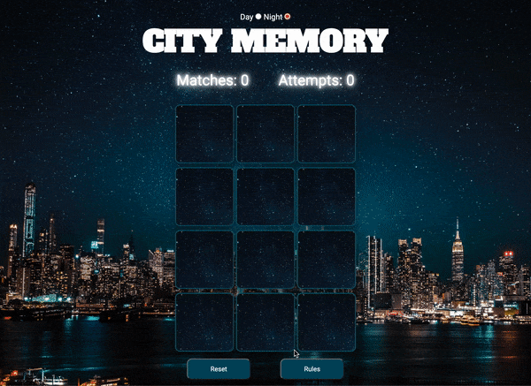
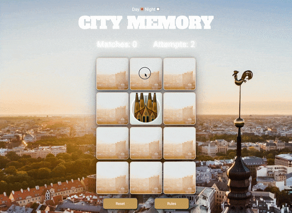
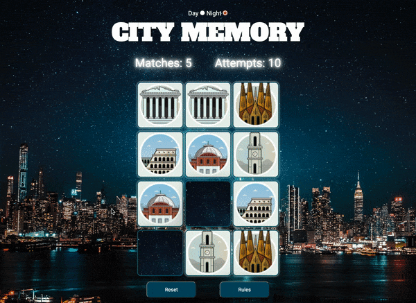
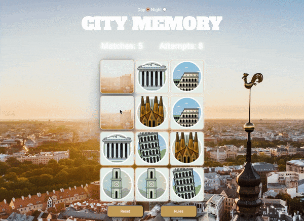

## Functional testing

### Three in a row

Testing to make sure you're not able to cause a bug by quickly clicking on three images in order to not activate the delay

### Day to night

Testing to see if the switch of theme works as indended.

### Reset button

Testing to see if the reset button works and resets clicks/matches.

### Rules button

Testing Rules in both day as well as night.

### Ongoing game between themes

Testing to make sure it's possible to, during an ongoing game, change between themes whilst keeping the score of the current game.

### Night theme You Won

Testing win function on night mode.

### Day theme You Won

Testing win function on day mode.

